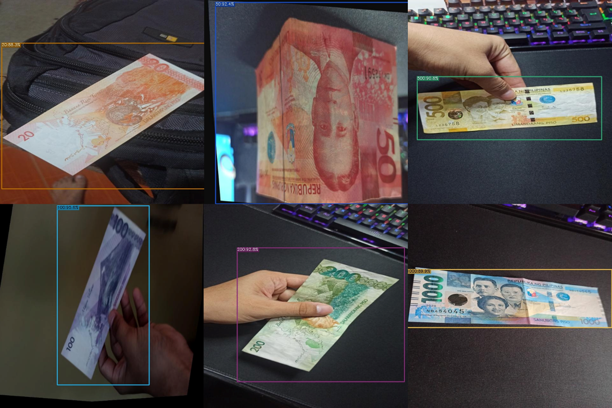
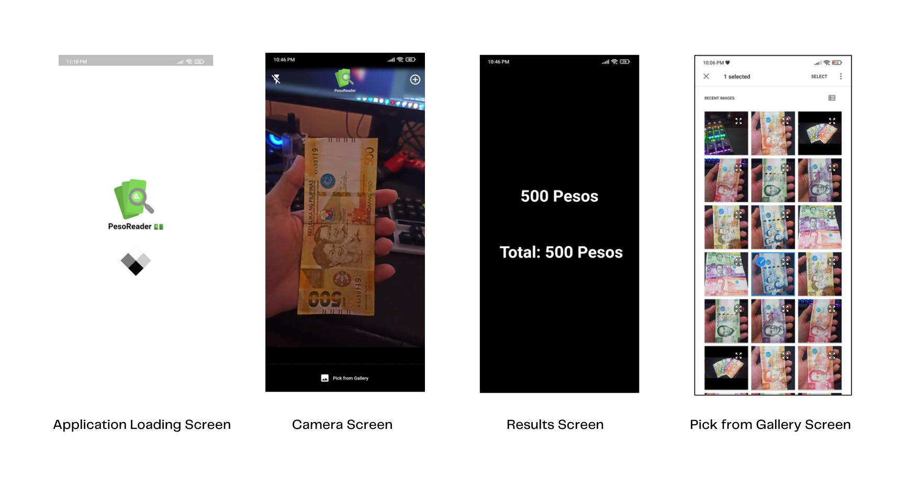

 

<h1 align='center'>PesoReader 💵</h1>

A Flutter application detecting Philippine banknotes for visually impaired users utilizing a YOLOX object detection model.

## Background 💡
Currency plays an important role as a means of exchange for goods and services. It is relatively simple for normal humans to identify and distinguish each banknote from one another, but one of the challenges faced by people who suffer from visual impairment is distinguishing currency due to the ineffectiveness and lack of tactile marks and the absence of assistive devices.

## Dataset Used 🖼
The dataset was manually gathered using smartphone cameras. Around **1,400 images** were collected for model training. The dataset is roughly composed of 200 images per bill (6 classes). 100 images at the front & 100 images at the back of the bill. It was also labeled manually using LabelImg, resized to 640x640 pixels and converted to PASCAL VOC format for training.
 ### Image Augmentation 🧙‍♂️
 From around 1,400 images, it increased to 2,600 images with the use of different image augmentation techniques. Methods that were used include **random rotation, brightness, width/height shift, zoom, resizing, flip, and shear**.
 

## Model Used 🔭
The object detection model used here is [YOLOX](https://github.com/Megvii-BaseDetection/YOLOX) is a single-stage object detector that makes several modifications to YOLOv3 with a DarkNet53 backbone. Specifically, YOLO’s head is replaced with a decoupled one. We YOLOX's PyTorch implementation for training.

Default Hyperparamters were used in training:
* Model Architecture: YOLOX-S
* Network size: 640x640
* Number of Epochs: 300
* Batch size: 16 
* Augmentation Epochs: 15
* Minimum learning rate ratio: 0.005
* Initial learning rate: 0.001

### Results 📝
| Class (Banknote denomination)                       |   Average Precision (AP)   |   No. of Test Images  |
|-----------------------------|----------------------------|-----------------------|
| 20 Pesos                  | 100.00 %                    | 108                   |
| 50 Pesos                | 99.66 %                    | 108                    |
| 100 Pesos      | 90.91 %                    | 107                    |
| 200 Pesos    | 100.00 %                    | 108                    |
| 500 Pesos       | 100.00 %                    | 108                    |
| 1000 Pesos      | 100.00 %                    | 107                   |
| Mean Average Precision (mAP)       | **98.43 %**                    | 646                   |

## Flutter App 📱
The Android Flutter app was developed using Flutter 3.0. The trained YOLOX model was exported to ONNX format and converted to [ncnn](https://github.com/Tencent/ncnn) for mobile deployment using these [steps](https://yolox.readthedocs.io/en/latest/demo/ncnn_cpp_readme.html). The detected bill's result is passed on the TTS engine to voice out via the smartphone speaker. App is also Talkback friendly.

Packages Used:
* [ncnn_yolox_flutter](https://github.com/KoheiKanagu/ncnn_yolox_flutter)
* camera 
* flutter_tts
* flutter_spinkit
* image_picker 

### App Snapshots 📸
